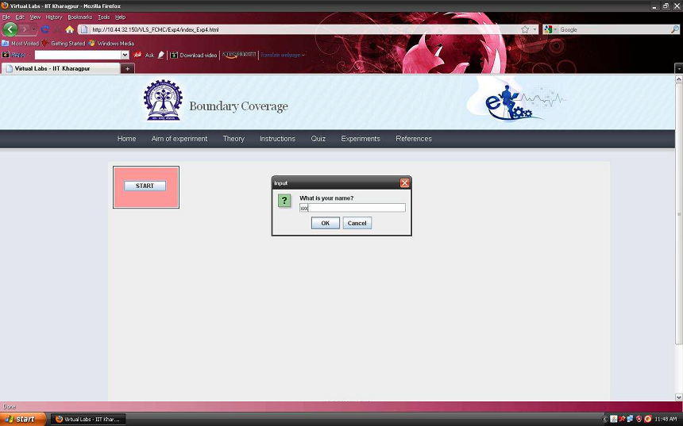
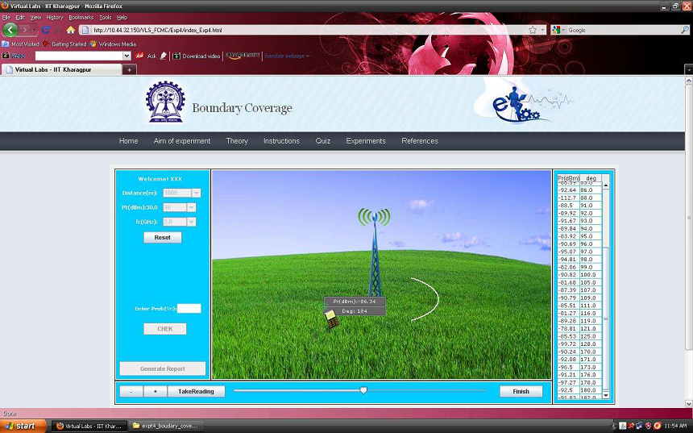
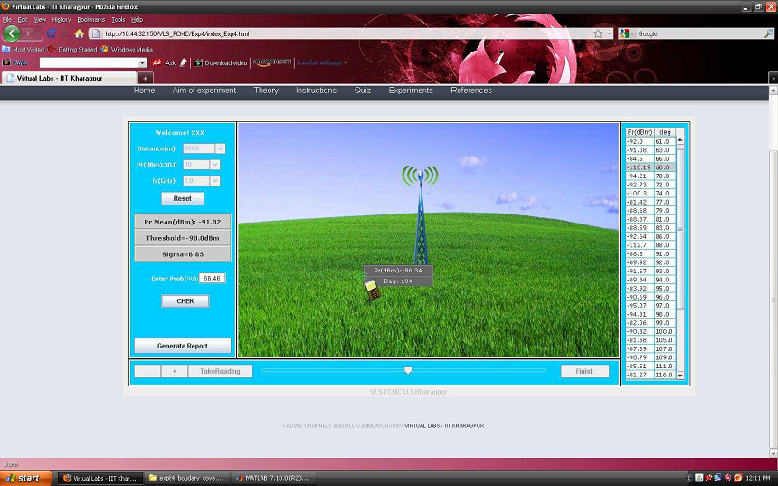
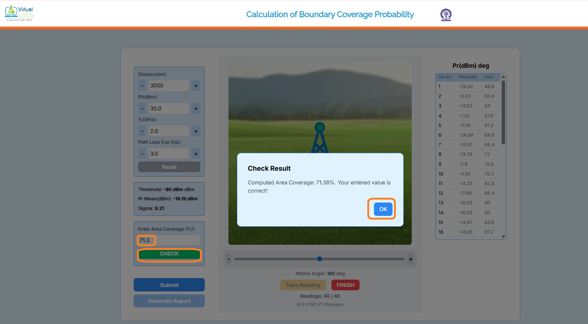
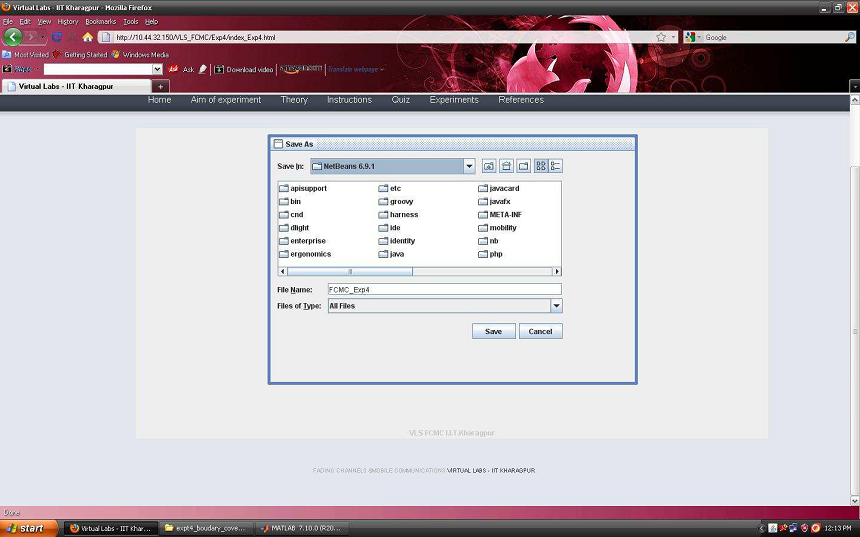
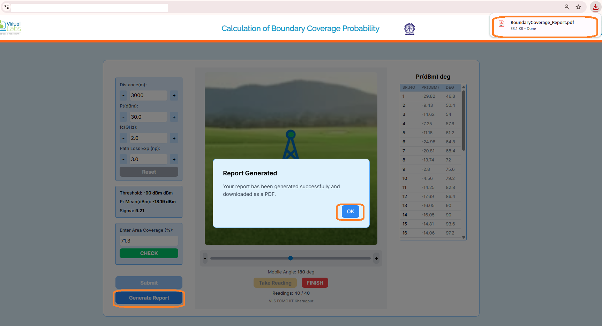
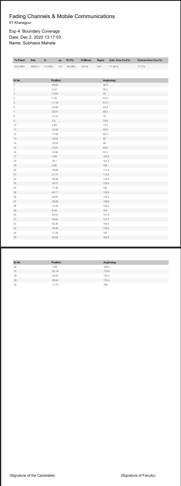

## Procedure
Follow the instructions given below to perform the experiments:-

### 1.1 Starting Experiment 4 :-

- Step 1:-Click on the button START. A page appears with a dialogue box asking for your name. Enter your name and click OK.

      
      

      
### 1.2 Performing the Experiment 4:-

- Step 2:-Adjust the slider to position your mobile.You can use the +,- buttons also to change the locations of your mobile.

- Step 3:- Click on the button TAKE READING to record the value of Pr(d) dBm and the angular distance of the mobile from the base station in degrees.You can view the table of Pr(d) dBm vs Degrees on the RHS of the page.Take 40 readings.

      
      

      
- Step 4:- Click on the button FINISH once you finish taking 40 readings. The values of the input parameters bar(Pr)dBm,sigma,threshold will be displayed on the LHS of the page.

      
      

      
- Step 5:- Now, calculate the probability that the received signal level>=some threshold (gamma) by using the formulas given in the theory section. Enter the values of the manually calculated unknown parameter in the box provided in the LHS of the page.

- Step 6:-Now, click on the button CHECK to verify whether your calculated value matches with the computed value. If, both the values doesnt match then the correct value will be displayed in the LHS of the page.

      
      

      
### 1.3 Generating the report :-

- Step 7:- Click on the button GENERATE REPORT to generate a report of the experiment you have performed. A dialogue box appears.

- Step 8:- Now, Click on the button SAVE given in the dialogue box to save your report.

      
      

      
- Step 9:- Once you click on the button SAVE in the dialogue box, another dialogue box appears with the message that your report is successfully generated. Click on the button OK in the dialogue box.
- 

      
      

      
Step 9:- Now, you can view your pdf report.

      
      

      

    
