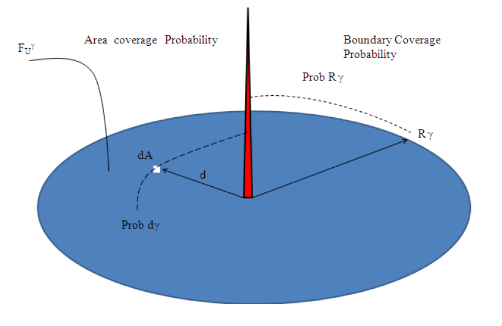
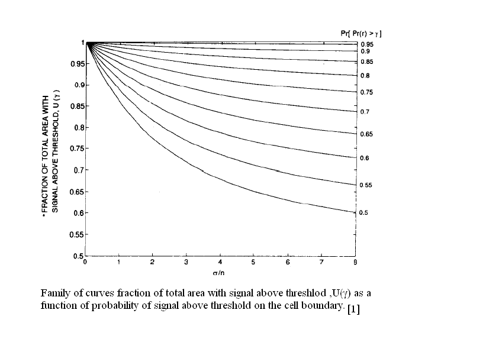

## Theory
**Introduction:**  

The circular coverage region of a Base Station is the area defined by a certain radius R with the Base Station at the center where the mean signal level received at the mobile unit remains above a specified threshold with certain probability. The probability mentioned above is decided based on quality of service requirement. If there is no shadow fading then the radius R can be calculated for a region where the signal level crosses the threshold with certainty.

However in real conditions, shadow fading plays an important role in cellular network design. Due to the random variation of the signal strength received owing to shadow fade, one needs to find the probability with which received signal strength crosses the predicted threshold. The detail derivation in the context of % boundary coverage and% area coverage are given below:

### 1.1 % Boundary Coverage:-

The received signal power in log domain at a distance d from the Base Station is given by:

$$P_r(d) = \bar{P_r}(d_0) + 10 n_p \log_{10}\left(\frac{d_0}{d}\right) + x_{dB}$$

Where,

- $x_{dB}$ represents shadow fading

- $x_{dB}$ is a random variable with Gaussian probability density function with mean $\bar{P_r}(d)$ and standard deviation $\sigma_{x_{dB}}$.

The probability that the signal level crosses the certain sensitivity level $\gamma$ is given by:

$$\text{Prob}[P_r(d) > \gamma] = \int_{\gamma}^{\infty} p(x)dx$$

$$= 1 - \int_{-\infty}^{\gamma} p(x)dx$$

$$= 1 - \text{Prob}[P_r(d) < \gamma]$$

$$= 1 - F_{P_r}(\gamma)$$

$$= 1 - \left[\frac{1}{2} + \frac{1}{2}\text{erf}\left(\frac{\gamma - \bar{P_r}(d)}{\sqrt{2}\sigma_{x_{dB}}}\right)\right] = \frac{1}{2}\text{erfc}\left(\frac{\gamma - \bar{P_r}(d)}{\sqrt{2}\sigma_{x_{dB}}}\right)$$

$$= Q\left(\frac{\gamma - \bar{P_r}(d)}{\sigma_{x_{dB}}}\right)$$

### 1.2 % Area Coverage:-

The % area coverage is determined by the radius $R_{\gamma}$ at which the signal level $\gamma$ exceeds the sensitivity level with probability $\text{Prob}_{R_{\gamma}}$ which is the likelihood of coverage at the cell boundary with $d=R_{\gamma}$.

$$\text{Prob}_{R_{\gamma}} = \text{Prob}[P_r(R_{\gamma}) > \gamma]$$

Given that $\text{Prob}[P_r(d) > \gamma]$ ($\text{Prob}_{d\gamma}$) is the probability that the signal in the range $0 < d < R_{\gamma}$ exceeds the sensitivity level, we can associate this with the probability that the level exceeds $\gamma$ within an infinitesimal area dA at the range d.

      
      

      
The % of useful area covered within the boundary of R with the received signal strength $\ge \gamma$ is:

$$F_u^{\gamma} = \frac{1}{\pi R_{\gamma}^2} \int \text{Prob}[P_r(d) > \gamma] dA$$

$$= \frac{1}{\pi R_{\gamma}^2} \int_{0}^{R_{\gamma}} \int_{0}^{2\pi} \text{Prob}[P_r(d) > \gamma] r dr d\theta$$

The power received can be referenced to the power received at cell boundary.

$$\bar{P_r}(d) = \bar{P_r}(d_0) + 10 n_p \log_{10}\left(\frac{d_0}{d}\right)$$

$$= \bar{P_r}(d_0) + 10 n_p \log_{10}\left(\frac{d_0}{R_{\gamma}}\right) + 10 n_p \log_{10}\left(\frac{R_{\gamma}}{d}\right) = \bar{P_r}(R_{\gamma}) + 10 n_p \log_{10}\left(\frac{R_{\gamma}}{d}\right)$$

Where,

$$\bar{P_r}(d_0) = P_t - \bar{PL}(d_0)$$

We shall use the radial distance r instead of d therefore:

$$\text{Prob}[P_r(r) > \gamma] = Q\left(\frac{\gamma - \bar{P_r}(r)}{\sigma_{x_{dB}}}\right)$$

$$= \frac{1}{2} - \frac{1}{2}\text{erf}\left(\frac{\gamma - \bar{P_r}(r)}{\sqrt{2}\sigma_{x_{dB}}}\right)$$

$$= \frac{1}{2} - \frac{1}{2}\text{erf}\left(\frac{\gamma - \left(\bar{P_r}(d_0) + 10n_p \log_{10}\left(\frac{d_0}{R_{\gamma}}\right) + 10n_p \log_{10}\left(\frac{R_{\gamma}}{r}\right)\right)}{\sqrt{2}\sigma_{x_{dB}}}\right)$$

$$= \frac{1}{2} - \frac{1}{2}\text{erf}\left(\frac{\gamma - \bar{P_r}(R_{\gamma})}{\sqrt{2}\sigma_{x_{dB}}} - \frac{10n_p \log_{10}(r/R_{\gamma})}{\sqrt{2}\sigma_{x_{dB}}}\right)$$

$$\text{Prob}[P_r(r) > \gamma] = \frac{1}{2} - \frac{1}{2}\text{erf}\left(a + b \ln\left(\frac{r}{R_{\gamma}}\right)\right)$$

Where:

$$a = \frac{\gamma - \bar{P_r}(R_{\gamma})}{\sqrt{2}\sigma_{x_{dB}}} = \frac{\gamma - (P_t - \bar{PL}(R_{\gamma}))}{\sqrt{2}\sigma_{x_{dB}}} \quad, \quad b = \frac{10 n_p \log_{10}(e)}{\sqrt{2}\sigma_{x_{dB}}}$$

$$F_u^{\gamma} = \frac{1}{2} - \frac{1}{R_{\gamma}^2} \int_{0}^{R_{\gamma}} r \cdot \frac{1}{2}\text{erf}\left(a + b \ln\left(\frac{r}{R_{\gamma}}\right)\right) dr$$

Making variable substitution $t = a + b \ln(r/R_{\gamma})$, it can shown that:

$$F_u^{\gamma} = \frac{1}{2}\left[1 - \text{erf}(a) + e^{\frac{1-2ab}{b^2}}\left(1 - \text{erf}\left(\frac{1-ab}{b}\right)\right)\right]$$

By choosing the signal level $\gamma$ such that $\bar{P_r}(R_{\gamma}) = \gamma$ (such that a=0), $F_u^{\gamma}$ can be shown to be:

$$F_u^{\gamma} = \frac{1}{2}\left[1 + e^{\frac{1}{b^2}}\left(1 - \text{erf}\left(\frac{1}{b}\right)\right)\right]$$

      
      

      
### 1.3 Examples:-

1. Given,

$\bar{P_r}(d_0) = 0 \text{ dBm}$,

$d_0 = 100 \text{ m}$,

$n_p = 4.5$,

$R_{\gamma} = 3000 \text{ m}$,

$\text{Prob}_{R_{\gamma}} = 0.65$,

and $\sigma = 6 \text{ dB}$.

Find the margin value ($\gamma - \bar{P_r}(R_{\gamma}$)):

First, find the mean received power at the boundary:

$$\bar{P_r}(R_{\gamma}) = \bar{P_r}(d_0) + 10 n_p \log_{10}\left(\frac{d_0}{R_{\gamma}}\right)$$

$$\bar{P_r}(R_{\gamma}) = 0 + 10 \cdot 4.5 \log_{10}\left(\frac{100}{3000}\right)$$

$$= -66.47 \text{ dBm}$$

Now, use the boundary probability:

$$\text{Prob}_{R_{\gamma}} = \text{Prob}[P_r(R_{\gamma}) > \gamma] = \frac{1}{2}\text{erfc}(a) = \frac{1}{2}(1 - \text{erf}(a))$$

$$0.65 = \frac{1}{2}(1 - \text{erf}(a))$$

$$1.3 = 1 - \text{erf}(a) \Rightarrow \text{erf}(a) = -0.3$$

$$\Rightarrow a = -0.2725$$

Now find $\gamma$ using the definition of $a$:

$$a = \frac{\gamma - \bar{P_r}(R_{\gamma})}{\sqrt{2}\sigma} \Rightarrow \gamma = a \sqrt{2}\sigma + \bar{P_r}(R_{\gamma})$$

$$\gamma = (-0.2725 \cdot \sqrt{2} \cdot 6) + (-66.47)$$

$$\gamma = -2.31 + (-66.47) = -68.78 \text{ dBm}$$

The margin is the difference between the required signal $\gamma$ and the mean signal $\bar{P_r}(R_{\gamma})$:

$$\text{Margin} = \gamma - \bar{P_r}(R_{\gamma}) = -68.78 - (-66.47) = -2.31 \text{ dB}$$

2. Given,

$\bar{P_r}(d_0) = 0 \text{ dBm}$,

$d_0 = 100 \text{ m}$,

$n_p = 3$,

$R_{\gamma} = 3000 \text{ m}$,

$\text{Prob}_{R_{\gamma}} = 0.5$,

and $\sigma = 9 \text{ dB}$.

Find % Area coverage $F_u^{\gamma}$:

First, find $\bar{P_r}(R_{\gamma})$:

$$\bar{P_r}(R_{\gamma}) = 0 + 10 \cdot 3 \log_{10}\left(\frac{100}{3000}\right)$$

$$= -44.3136 \text{ dBm}$$

Now find $a$:

$$\text{Prob}_{R_{\gamma}} = 0.5 \Rightarrow 0.5 = \frac{1}{2}(1 - \text{erf}(a)) \Rightarrow \text{erf}(a) = 0 \Rightarrow a = 0$$

(This means $\gamma = \bar{P_r}(R_{\gamma}) = -44.3136 \text{ dBm}$)

Now find $b$:

$$b = \frac{10 n_p \log_{10}(e)}{\sqrt{2}\sigma}$$

$$= \frac{10 \cdot 3 \cdot 0.4343}{\sqrt{2} \cdot 9} = \frac{13.029}{12.726}$$

$$= 1.0238$$

Now, calculate % Area Coverage using the formula for $a=0$:

$$F_u^{\gamma} = \frac{1}{2}\left[1 + e^{\frac{1}{b^2}}\left(1 - \text{erf}\left(\frac{1}{b}\right)\right)\right] \times 100\%$$

$$F_u^{\gamma} = \frac{1}{2}\left[1 + e^{\frac{1}{1.0238^2}}\left(1 - \text{erf}\left(\frac{1}{1.0238}\right)\right)\right] \times 100\%$$

$$F_u^{\gamma} = \frac{1}{2}\left[1 + e^{0.953}\left(1 - \text{erf}(0.9767)\right)\right] \times 100\%$$

$$F_u^{\gamma} = \frac{1}{2}\left[1 + 2.59(1 - 0.8326)\right] \times 100\%$$

$$F_u^{\gamma} = \frac{1}{2}\left[1 + 2.59(0.1674)\right] \times 100\%$$

$$F_u^{\gamma} = \frac{1}{2}\left[1 + 0.4336\right] \times 100\% = 0.7168 \times 100\%$$

$$= 71.68\%$$

So, % area coverage $\approx 71.71\%$

     
 
